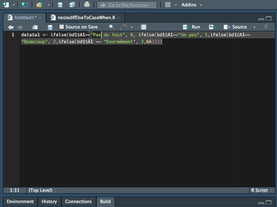

# unnestIfElse

RStudio Addin to quickly and roughly convert nested `ifelse()` statements to
`dplyr::case_when()`.



**Contents**

- [Installation and requirements](#installation-and-requirements)
- [Before and after](#before-and-after)
- [Motivation](#motivation)
- [Features](#features)
- [Limitations](#limitations)
- [Examples](#examples)
- [TODO](#todo)
- [License](#license)


## Installation and requirements

**Install**

```r
devtools::install_github("erictleung/unnestIfElse")
```

**Requirements**

```
dplyr
magrittr
stringr
rstudioapi
```


## Before and after

**Before**:

```
ifelse(statement, TRUE, FALSE)
```

**After**:

```
case_when(
  statement ~ TRUE
  TRUE ~ FALSE
)
```


## Motivation

Inspired by:

<blockquote class="twitter-tweet"><p lang="en" dir="ltr"><a href="https://twitter.com/hashtag/rstats?src=hash&amp;ref_src=twsrc%5Etfw">#rstats</a> does someone have a magic function to turn nested ifelse statements into dplyr::casewhen?</p>&mdash; Gordon Shotwell (@gshotwell) <a href="https://twitter.com/gshotwell/status/1187783316038148096?ref_src=twsrc%5Etfw">October 25, 2019</a></blockquote>


## Features

- Changes highlighted text in place
- Highlighted text should be complete `ifelse()` expression


## Limitations

- Only works for highlighted text, cannot convert an entire script
- Highlighted text has to exclusively include complete `ifelse()` statement
- Lacking any error handling
- Doesn't handle the case if the last "no" value is some function call with
  parentheses (e.g., `ifelse(1 != 1, -4, abs(-4))`)
- Limited test coverage for use
- Code formatting will fail with any text with commas (see below)

```r
# Addin will fail with this example
# Source:
# https://github.com/Sean-Hughes/Relational_Complexity_Derivation/blob/master/Analyses/independent%20t%20test%20-%20IAT%20D1.R
nhst <- ifelse(t_test_p < 0.05, 
               paste("A Welch's independent t test demonstrated significant differences of ", d_interpretation, " effect size in ", DV_name, " between ", sep = ""),
               paste("A Welch's independent t test demonstrated non-significant differences of ", d_interpretation, " effect size between ", sep = ""))

# Another example that will fail
# Source: https://github.com/wmlutz/r-lesson/blob/master/hold_temp.R
aw$cert_Admin <- ifelse("Admin" %in% raw[,"Certifications"], 1,0)
```


## Examples

I did a quick advanced GitHub search of `ifelse language:R` to find these
examples. I've tried to pick a mix of short to long examples. I also wanted to
make sure this function works on code in the "wild".


### Simple

Source: https://github.com/Anis-Bensaid/SBT13/blob/master/Script%20R%20Final.R

**Before**:

```r
data$a1 <- ifelse(bd1$A1=="Pas du tout", 0, ifelse(bd1$A1=="Un peu", 1,ifelse(bd1$A1== "Beaucoup", 2,ifelse(bd1$A1 == "Enormément", 3,NA))))
```

**After**:

```r
data$a1 <- case_when(
  bd1$A1=="Pas du tout" ~  0,
   bd1$A1=="Un peu" ~  1,
  bd1$A1== "Beaucoup" ~  2,
  bd1$A1 == "Enormément" ~  3,
  TRUE ~ NA
)
```


### Mix of numbers

Source: https://github.com/ajpelu/qpyr_resilience/blob/master/R/getComposite.R

**Before**:

```r
getComposite_nonleap <- function(m,d){
  # m = month
  # d = day
  ifelse(m == 1 & d < 17, 1,
  ifelse(m == 1 & d >= 17, 2,
  ifelse(m == 2 & d < 2, 2,
  ifelse(m == 2 & d < 18, 3,
  ifelse(m == 2 & d >= 18, 4,
  ifelse(m == 3 & d < 6, 4,
  ifelse(m == 3 & d < 22, 5,
  ifelse(m == 3 & d >= 22, 6,
  ifelse(m == 4 & d < 7, 6,
  ifelse(m == 4 & d < 23, 7,
  ifelse(m == 4 & d >= 23, 8,
  ifelse(m == 5 & d < 9, 8,
  ifelse(m == 5 & d < 25, 9,
  ifelse(m == 5 & d >= 25, 10,
  ifelse(m == 6 & d < 10, 10,
  ifelse(m == 6 & d < 26, 11,
  ifelse(m == 6 & d >= 26, 12,
  ifelse(m == 7 & d < 12, 12,
  ifelse(m == 7 & d < 28, 13,
  ifelse(m == 7 & d >= 28, 14,
  ifelse(m == 8 & d < 13, 14,
  ifelse(m == 8 & d < 29, 15,
  ifelse(m == 8 & d >= 29, 16,
  ifelse(m == 9 & d < 14, 16,
  ifelse(m == 9 & d < 30, 17,
  ifelse(m == 9 & d >= 30, 18,
  ifelse(m == 10 & d < 16, 18,
  ifelse(m == 10 & d >= 16, 19,
  ifelse(m == 11 & d < 17, 20,
  ifelse(m == 11 & d >= 17, 21,
  ifelse(m == 12 & d < 3, 21,
  ifelse(m == 12 & d < 19, 22, 23))))))))))))))))))))))))))))))))
}
```

**After**:

```r
getComposite_nonleap <- function(m,d){
  # m = month 
  # d = day 
  case_when(
  m == 1 & d < 17 ~ 1,
  m == 1 & d >= 17 ~ 2,
  m == 2 & d < 2 ~ 2,
  m == 2 & d < 18 ~ 3,
  m == 2 & d >= 18 ~ 4,
  m == 3 & d < 6 ~ 4,
  m == 3 & d < 22 ~ 5,
  m == 3 & d >= 22 ~ 6,
  m == 4 & d < 7 ~ 6,
  m == 4 & d < 23 ~ 7,
  m == 4 & d >= 23 ~ 8,
  m == 5 & d < 9 ~ 8,
  m == 5 & d < 25 ~ 9,
  m == 5 & d >= 25 ~ 10,
  m == 6 & d < 10 ~ 10,
  m == 6 & d < 26 ~ 11,
  m == 6 & d >= 26 ~ 12,
  m == 7 & d < 12 ~ 12,
  m == 7 & d < 28 ~ 13,
  m == 7 & d >= 28 ~ 14,
  m == 8 & d < 13 ~ 14,
  m == 8 & d < 29 ~ 15,
  m == 8 & d >= 29 ~ 16,
  m == 9 & d < 14 ~ 16,
  m == 9 & d < 30 ~ 17,
  m == 9 & d >= 30 ~ 18,
  m == 10 & d < 16 ~ 18,
  m == 10 & d >= 16 ~ 19,
  m == 11 & d < 17 ~ 20,
  m == 11 & d >= 17 ~ 21,
  m == 12 & d < 3 ~ 21,
  m == 12 & d < 19 ~ 22,
  TRUE ~ 23
)
}
```


### Text and numbers

Source: https://github.com/WWF-ConsEvidence/ACES/blob/master/Mozambique/Harmonized_Demographic_Data.R

**Before**:

```r
Community2008 <- ifelse(dat2008$Community_code == 241601, "Fuzi", 
             ifelse(dat2008$Community_code == 41602, "Moebase",
             ifelse(dat2008$Community_code==41603, "Txotxo",
             ifelse(dat2008$Community_code ==41604, "Monudo/Murudo", 
             ifelse(dat2008$Community_code ==41605, "Namige", 
             ifelse(dat2008$Community_code ==41606, "Solulo", 
             ifelse(dat2008$Community_code ==41607, "Magene", 
             ifelse(dat2008$Community_code ==41608, "Murateia", 
             ifelse(dat2008$Community_code ==41609, "Namaquete", 
             ifelse(dat2008$Community_code ==31101, "Mtopa", 
             ifelse(dat2008$Community_code ==31102, "Hori", 
             ifelse(dat2008$Community_code ==31103, "Mecane (Oua)", 
             ifelse(dat2008$Community_code ==31104, "Nacocolo", 
             ifelse(dat2008$Community_code ==31105, "Pacone", 
             ifelse(dat2008$Community_code ==31106, "Ampuitine",
             ifelse(dat2008$Community_code ==31107, "Corane",
             ifelse(dat2008$Community_code ==31108, "Lalaue",
             ifelse(dat2008$Community_code ==31109, "Mavele",
             ifelse(dat2008$Community_code ==31110, "Mucoroma",
             ifelse(dat2008$Community_code ==31111, "Nacalela",
             ifelse(dat2008$Community_code ==31112, "Nambui",
             ifelse(dat2008$Community_code ==31113, "Namichir",
             ifelse(dat2008$Community_code ==31114, "Nanheua",
             ifelse(dat2008$Community_code ==31115, "Natere",
             ifelse(dat2008$Community_code ==31116, "Tipane",
             ifelse(dat2008$Community_code ==30101, "Iarupa",
             ifelse(dat2008$Community_code ==30102, "Mituco",
             ifelse(dat2008$Community_code ==30103, "Macogone",
             ifelse(dat2008$Community_code ==30104, "Munar",
             ifelse(dat2008$Community_code ==30105, "Namiepe",
             ifelse(dat2008$Community_code ==30106, "Nauluco",
             ifelse(dat2008$Community_code ==30107, "Pulizica",
             ifelse(dat2008$Community_code ==30108, "Naheco",
             ifelse(dat2008$Community_code ==30109, "Namame",NA))))))))))))))))))))))))))))))))))
```

**After**:

```r
Community2008 <- case_when(
  dat2008$Community_code == 241601 ~ "Fuzi",
  dat2008$Community_code == 41602 ~ "Moebase",
  dat2008$Community_code==41603 ~ "Txotxo",
  dat2008$Community_code ==41604 ~ "Monudo/Murudo",
  dat2008$Community_code ==41605 ~ "Namige",
  dat2008$Community_code ==41606 ~ "Solulo",
  dat2008$Community_code ==41607 ~ "Magene",
  dat2008$Community_code ==41608 ~ "Murateia",
  dat2008$Community_code ==41609 ~ "Namaquete",
  dat2008$Community_code ==31101 ~ "Mtopa",
  dat2008$Community_code ==31102 ~ "Hori",
  dat2008$Community_code ==31103 ~ "Mecane (Oua)",
  dat2008$Community_code ==31104 ~ "Nacocolo",
  dat2008$Community_code ==31105 ~ "Pacone",
  dat2008$Community_code ==31106 ~ "Ampuitine",
  dat2008$Community_code ==31107 ~ "Corane",
  dat2008$Community_code ==31108 ~ "Lalaue",
  dat2008$Community_code ==31109 ~ "Mavele",
  dat2008$Community_code ==31110 ~ "Mucoroma",
  dat2008$Community_code ==31111 ~ "Nacalela",
  dat2008$Community_code ==31112 ~ "Nambui",
  dat2008$Community_code ==31113 ~ "Namichir",
  dat2008$Community_code ==31114 ~ "Nanheua",
  dat2008$Community_code ==31115 ~ "Natere",
  dat2008$Community_code ==31116 ~ "Tipane",
  dat2008$Community_code ==30101 ~ "Iarupa",
  dat2008$Community_code ==30102 ~ "Mituco",
  dat2008$Community_code ==30103 ~ "Macogone",
  dat2008$Community_code ==30104 ~ "Munar",
  dat2008$Community_code ==30105 ~ "Namiepe",
  dat2008$Community_code ==30106 ~ "Nauluco",
  dat2008$Community_code ==30107 ~ "Pulizica",
  dat2008$Community_code ==30108 ~ "Naheco",
  dat2008$Community_code ==30109 ~ "Namame",
  TRUE ~ NA
)
```


## TODO

- Convert multiple `ifelse` statements that span multiple lines
  (e.g., https://github.com/Anis-Bensaid/SBT13/blob/master/Script%20R%20Final.R)


## License

MIT
